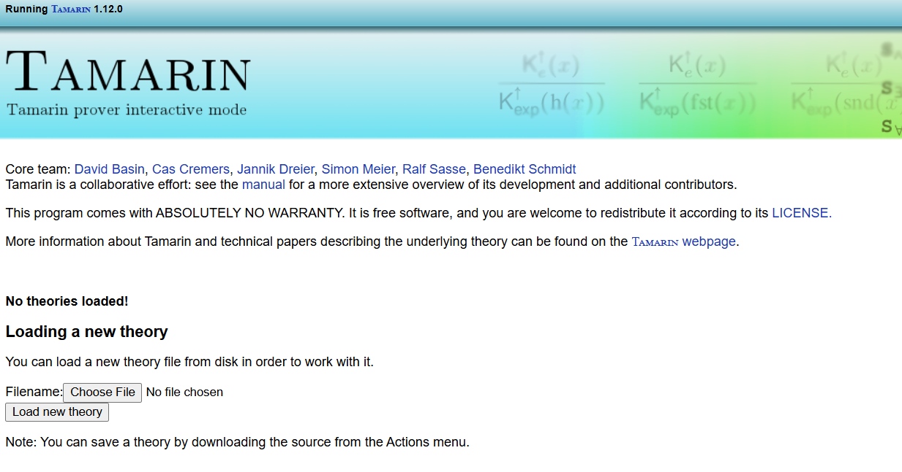
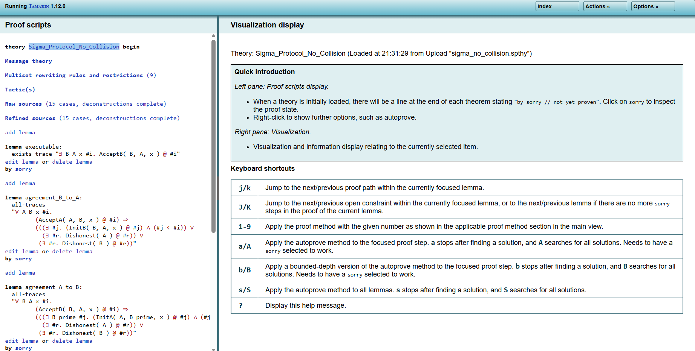

## Setup

This document captures the steps to install Homebrew and Tamarin on Linux or macOS.

### 1) Install Homebrew

Website: https://brew.sh/

Run the installer:

```bash
/bin/bash -c "$(curl -fsSL https://raw.githubusercontent.com/Homebrew/install/HEAD/install.sh)"
```

Linux details: https://docs.brew.sh/Homebrew-on-Linux

### 2) Add Homebrew to your shell

Run the following lines (per the Linux instructions) to ensure `brew` is on your PATH:

```bash
test -d ~/.linuxbrew && eval "$(~/.linuxbrew/bin/brew shellenv)"
test -d /home/linuxbrew/.linuxbrew && eval "$(/home/linuxbrew/.linuxbrew/bin/brew shellenv)"
echo "eval \"\$($(brew --prefix)/bin/brew shellenv)\"" >> ~/.bashrc
```

Verify Homebrew works by installing a test package:

```bash
brew install hello
```

### 3) Install Tamarin

Tamarin install docs: https://tamarin-prover.com/install.html

Install via Homebrew:

```bash
brew install tamarin-prover/tap/tamarin-prover
```

### 4) Run Tamarin

```bash
tamarin-prover interactive .
```

Run this from the repo root so the working directory is correct.

### 5) Tamarin Web GUI

The Tamarin web GUI runs on http://localhost:3001.

### 6) Translate ProVerif models to Tamarin

Use an LLM to translate the ProVerif models to Tamarin syntax. Provide these library files as reference:

- hash_collision.pvl
- hash_no_collision.pvl
- isCol.pvl

Also provide the respective protocol file from the ProVerif repository:
https://github.com/Hafeez-hm/Hash-Gone-Right

Save the translated protocol files under the protocols directory with a .spthy extension.

### 7) Use the Web GUI



In the web GUI, click Choose File and then Load New Theory. After loading, it should look like this:



Press 'a' to run lemmas one by one automatically. Lemmas turn green when proved and red when a counterexample (attack) is found.

### 8) Run proofs from the CLI

For a clean summary in the terminal, run for example:

```bash
tamarin-prover protocols/sigma/sigma_no_collision.spthy --prove
```

### 9) Protocols to cover

- Simplified IKEv2
- macs.pv
- wmf-auth.pv
- Proba-pk.pv
- NDSS IKEv2
- Sigma
